# 🗺️ The Making of a Fraud Detector — A Visual Journey

> *This document walks through every step of building the Credit Card Fraud Detection system — from the first look at raw data all the way to a live web prediction. Every decision, every plot, every "aha" moment, documented with screenshots straight from the notebook.*

---

## 📍 Where We Start: Understanding the Data

### The First Problem — Nothing Is What It Seems

The very first thing you notice when you open this dataset: **99.83% of transactions are legitimate**. Only 492 out of 284,807 are fraud.

This means a model that just screams "NOT FRAUD" on everything would score **99.83% accuracy**. Completely useless. This single observation shapes every decision we make from here.

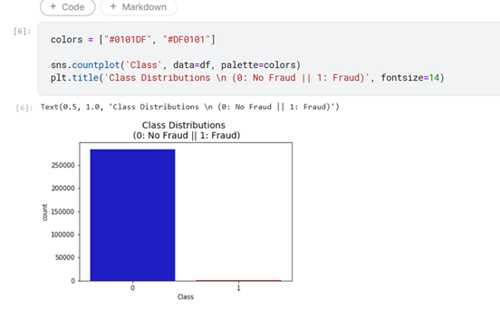


---

### Getting a Feel for the Numbers

The transaction `Amount` and `Time` columns are the only two features in their raw form — everything else (V1–V28) is already PCA-transformed for privacy. A quick look at their distributions shows they're heavily skewed.

- Average transaction amount: ~**$88**
- No null values anywhere — clean data from the start ✅

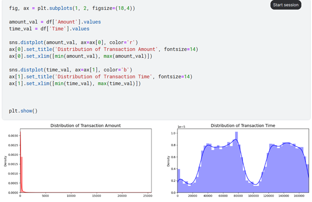 

---

## ⚙️ Phase I: Pre-Processing

### Step 1 — Scaling Amount & Time

Since V1–V28 are already scaled (PCA output), `Amount` and `Time` stick out. We apply **RobustScaler** — chosen specifically because it's resistant to outliers, unlike StandardScaler.

After scaling, the two new columns `scaled_amount` and `scaled_time` replace the originals.

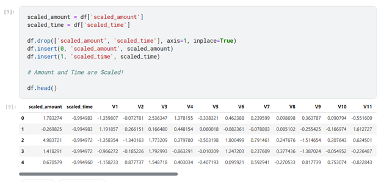

---

### Step 2 — Splitting the Data (The Right Way)

Before we touch any sampling technique, we first split the **original dataset** into train/test. This is critical — the test set must reflect real-world distribution.

**Why split before sampling?** Because we want to evaluate our models on real, imbalanced data — not on artificially balanced data. Whatever happens in training stays in training.

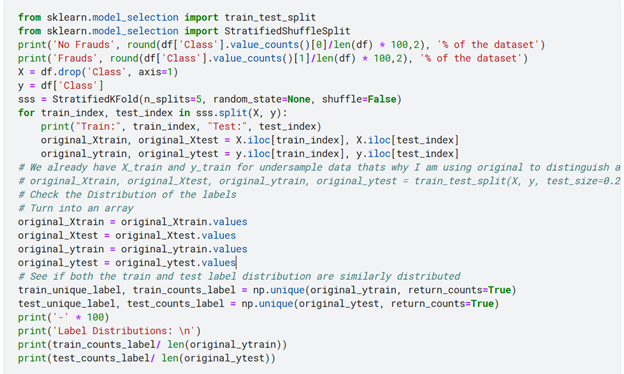

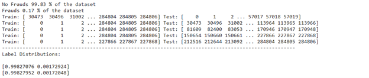

---

## ⚖️ Phase II: Fighting the Class Imbalance

### Random UnderSampling — The Fast Approach

We take all **492 fraud cases** and randomly pick **492 non-fraud cases** → a perfectly balanced 50/50 subset.

The risk: we're throwing away 283,823 legitimate transactions. That's a lot of information gone.

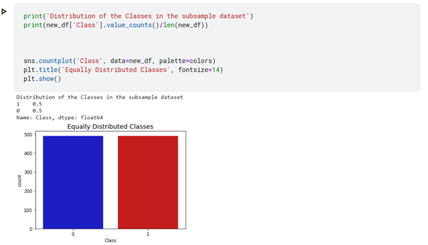

---

### Reading the Correlations

With a balanced dataset, we can now trust the correlation matrix. On the imbalanced original data, correlations are distorted by the overwhelming majority class.

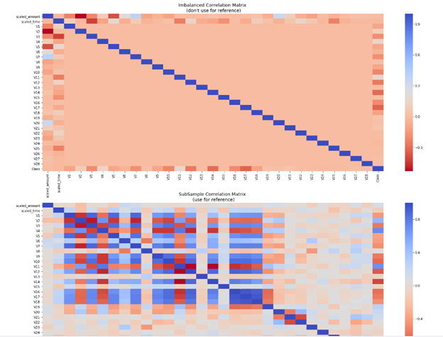

Key findings:
- **Negatively correlated with fraud:** V17, V14, V12, V10 — the lower these values, the more likely it's fraud
- **Positively correlated with fraud:** V2, V4, V11, V19 — the higher, the more suspicious

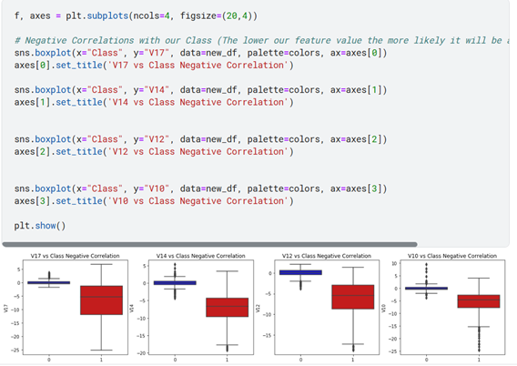

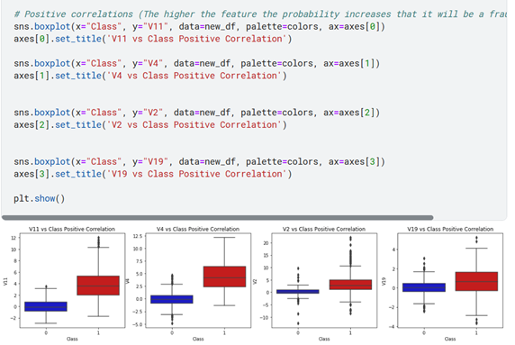


---

### Anomaly Detection — Cutting the Extremes

Extreme outliers in the most correlated features (V14, V12, V10) distort the model's decision boundary. We use the **IQR method** to identify and remove them.

> ⚡ After removing extreme outliers, model accuracy improved by over **3%**

**Before removal:**

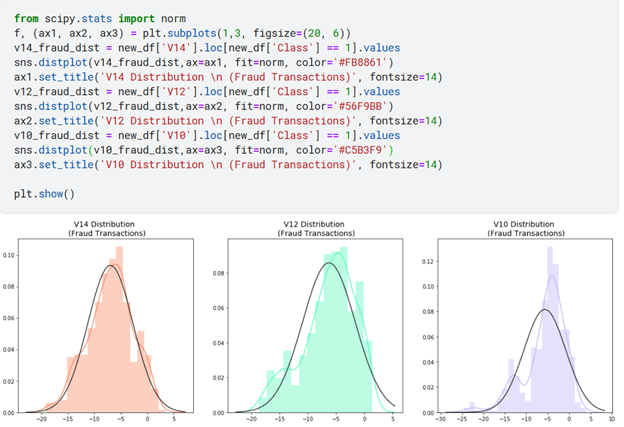

**After removal — boxplots are much cleaner:**

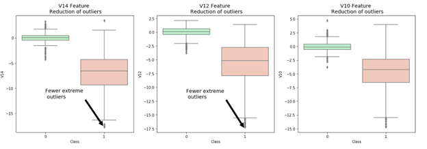

---

### t-SNE — Can We Actually Separate Fraud from Non-Fraud?

Before training any model, we run **t-SNE** to visualize whether the two classes are actually separable in high-dimensional space. If they cluster apart — models will work. If they overlap completely — we have a problem.

The result was encouraging:

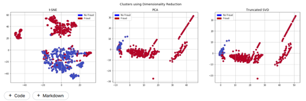


> ✅ Even on a small subsample, t-SNE clearly separates fraud from non-fraud clusters — a strong signal that ML models will perform well.

---

## 🤖 Phase III: Training the Classifiers

### 4 Models, Head to Head

We train Logistic Regression, KNN, SVM, and Decision Tree — all on the undersampled balanced subset — and compare their ROC-AUC scores using cross-validation.

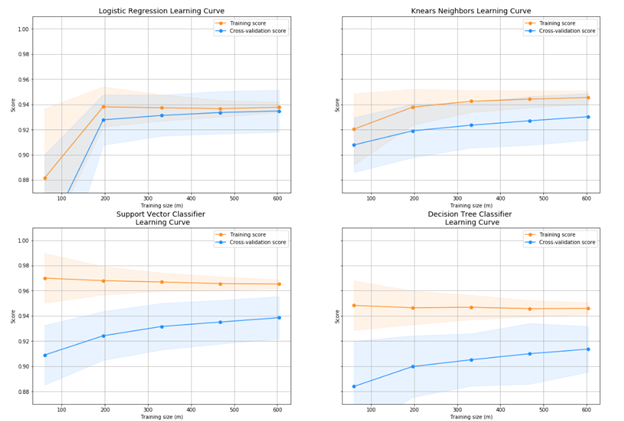

**Training scores (UnderSampling):**
| Model | Training Accuracy |
|---|---|
| Logistic Regression | **93%** |
| KNN | 93% |
| SVC | 93% |
| Decision Tree | 92% |

### Learning Curves — Checking for Overfit

The gap between training score and cross-validation score tells us everything about generalization. A wide gap = overfitting.

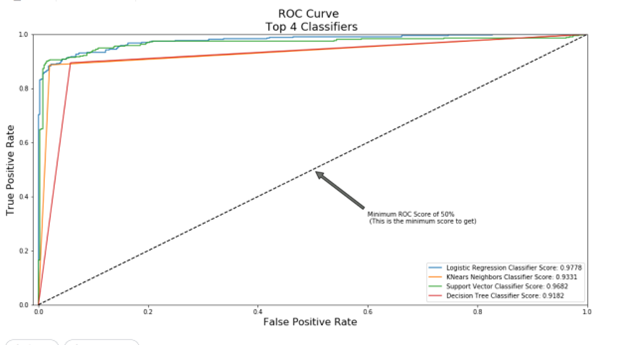


---

### A Deeper Look at Logistic Regression

Logistic Regression consistently came out on top. We dig deeper into its confusion matrix and ROC curve.

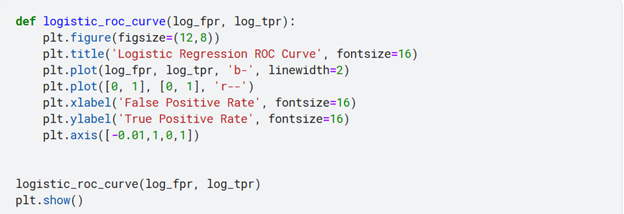

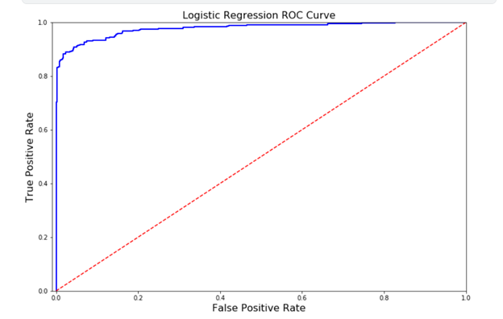

### The Precision / Recall Tradeoff

This is the most important curve for fraud detection. Precision and Recall pull in opposite directions — the more selective the model, the fewer fraud cases it catches.

We tune the threshold to **maximize recall** (catch as many frauds as possible) while keeping precision at an acceptable level.


---

## 🔬 Phase IV: SMOTE — A Better Way to Balance

### What Is SMOTE?

Unlike UnderSampling which throws data away, **SMOTE** (Synthetic Minority Over-sampling Technique) *creates* new synthetic fraud samples by interpolating between existing ones. More data, less information loss.


### ⚠️ A Mistake I Made — and How I Fixed It

This is the most important lesson in the entire project.

**The Wrong Way** — applying SMOTE *before* cross-validation:

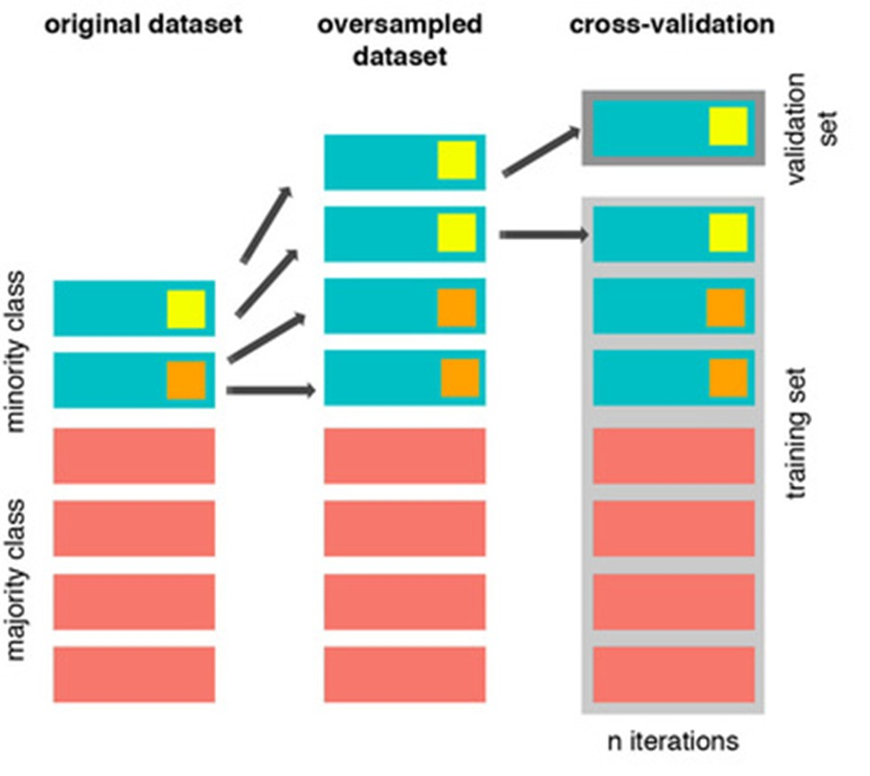

If you generate synthetic samples before splitting into folds, those synthetic points leak into the validation set. The model "sees" the validation data during training — scores look amazing but the model is completely overfit. 

**The Right Way** — applying SMOTE *inside* the CV loop:

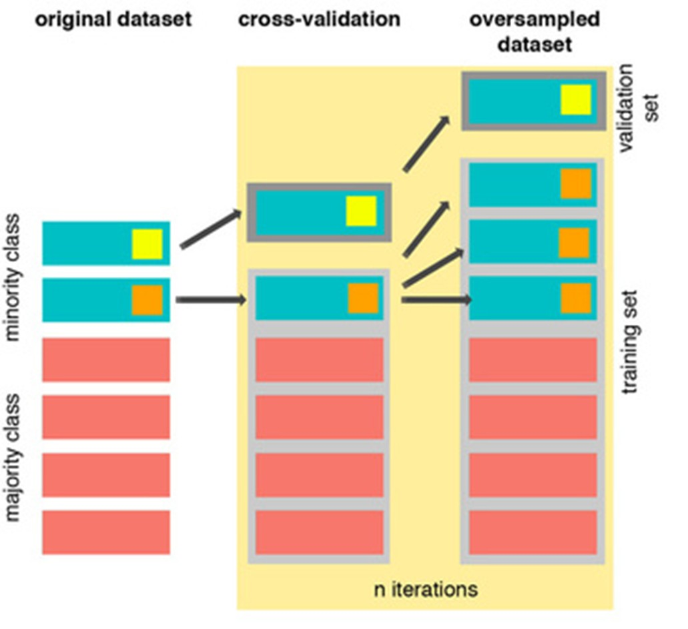

Synthetic points are only created for the training fold. The validation fold always stays original and untouched. This is the correct approach.

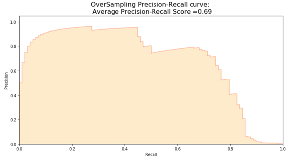


---

## 📊 Phase V: Final Testing & Evaluation

### All 4 Models — Final Confusion Matrices

After training, we evaluate everything on the **original imbalanced test set** — the real-world scenario.

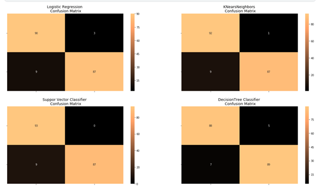

> **Winner: Logistic Regression + SMOTE** — best recall on the fraud class with acceptable false positives.

---

### Neural Network Testing

We also test a simple Keras neural network on both undersampled and SMOTE data to compare.

**UnderSampling results:**

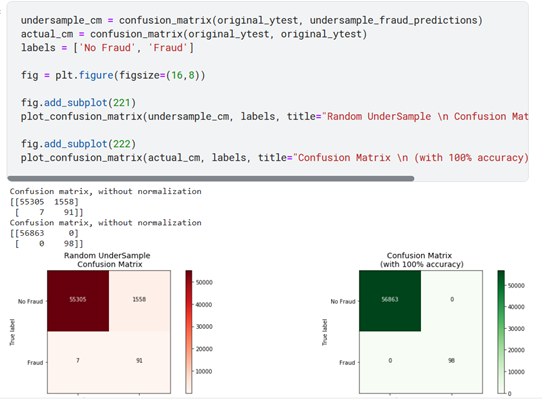

**SMOTE results:**

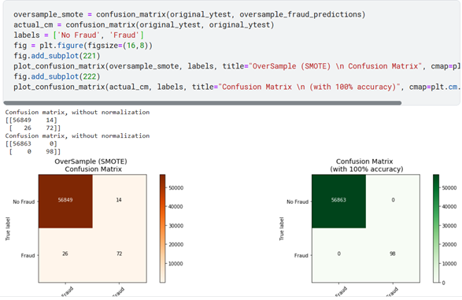

Despite the Neural Network's complexity, **Logistic Regression + SMOTE** still won on recall — the metric that matters most for fraud detection.

---

## 🌐 Phase VI: Deployment — The Flask Web App

The final step: turning the trained model into something anyone can use without touching a line of code.

### The Home Page


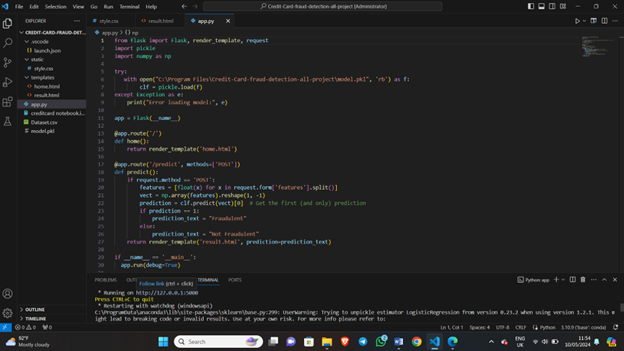

---

### A Real Prediction — Live

**Entering the transaction features:**

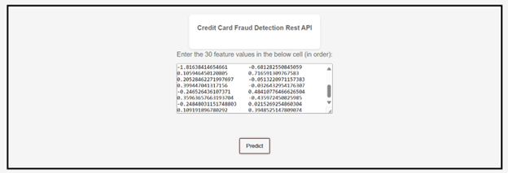

**The result:**

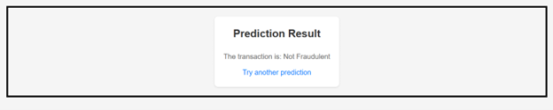

> The model correctly classifies the transaction as **Not Fraudulent** in real time. ✅

---

## 🏁 End of the Journey

What started as 284,807 rows of anonymized numbers became a live fraud detection system. Here's the full path in one line:

```
Raw Data → EDA → Scaling → UnderSampling/SMOTE → 
Train 5 Models → Evaluate on Real Data → Deploy as Flask API
```

Every plot above was a decision point. Every mistake documented was a lesson learned.

---

*← Back to [README.md](README.md)*
